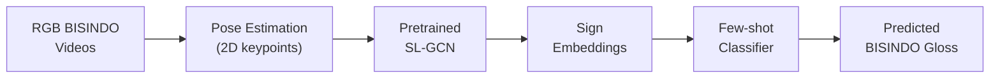

# Efficient BISINDO Sign Recognition
from Pose Keypoints

### Research Proposal

Vauwez Sam El Fareez

20249258020@cumhuriyet.edu.tr

<!-- 

Supervised by: *TBD*
Program: *TBD*

 -->

---
layout: center
class: text-center
---

# Why This Research Matters

> "Sign languages are visual-spatial languages used by Deaf communities."

We want computers to **see and understand BISINDO signs** so that:

- Deaf and hearing people can communicate more easily
- Technology in Indonesia can better support BISINDO users
- Under-resourced sign languages are not left behind in the AI era

---

# Background: What is Sign Language?

- Uses **hands, face, and body** instead of voice
- Is a **natural language** with its own grammar, not just gestures
- Varies between countries and even regions (ASL, BSL, TID, BISINDO, etc.)
- For many Deaf people, the surrounding spoken language is actually a
  **second language**

💡 **Key idea:** We need technology that understands **sign language itself**, not just written or spoken language.

---

# The Communication Gap

- Hearing people usually **don't know BISINDO**
- Deaf people may struggle with **complex written Indonesian**
- Result: daily communication often needs **interpreters or text**
- But text **does not fully capture** sign language structure and nuance

**Goal:** Use computer vision + AI to **bridge this gap**.

---

# Sign Language Recognition (SLR)

We let a camera capture the signer and let AI:

1. **See** the motion (video / keypoints)
2. **Recognize** the sign
3. **Output** a gloss (word) or sentence

Two main types:

- **Isolated SLR** – recognize **single words**
- **Continuous SLR** – recognize **sentences / utterances**

This proposal focuses on **isolated SLR** for BISINDO.

---

# Data: The Big Problem

Modern AI (like large language models) works well because:

- There is **massive text data** on the internet

For sign language, it's different:

- Recording and annotating sign videos is **slow and expensive**
- Creating **1 minute of labeled sign video** can take **10–30 minutes**
- Only a **few languages** have large, public datasets (ASL, BSL, TID, etc.)

BISINDO is currently **under-resourced**.

---

# Existing Sign Language Datasets

Well-studied sign languages:

- **ASL** – multiple large datasets (e.g., WLASL, MS-ASL)
- **TID** – AUTSL dataset with RGB, depth, skeleton
- **BSL** – BOBSL dataset with large-scale TV data

Indonesia:

- **SIBI** dataset (Indonesian Sign System) – letters, numbers, affixes, sentences
- **WL-BISINDO** dataset – 32 isolated signs, RGB videos from 5 signers

But: **BISINDO still lacks large, diverse datasets** for hundreds of words.

---

# How Do Researchers Cope with Limited Data?

Two popular strategies:

1. **Transfer Learning**
   - Train a model on a **large source dataset** (e.g., ASL, TID)
   - **Fine-tune** it on a smaller target dataset (e.g., BISINDO)

2. **Few-Shot Learning (FSL)**
   - Train a model so it can recognize **new classes** (new words)
   - Given only **a few examples per class** at test time

This proposal focuses on **few-shot learning** for **isolated BISINDO SLR**.

---

# Few-Shot Learning: Intuition

Imagine teaching someone a new sign language word:

- You show **3–5 video examples** of a new word
- After that, they can often **recognize it** in new videos

Few-shot learning aims for the **same ability in AI models**:

- During training: learn a good **embedding space** for signs
- During testing: for each new class, build a **prototype** from few examples
- Classify new samples by **distance to prototypes**

One popular method: **Prototypical Networks**.

---

# Why Few-Shot for BISINDO?

- Natural languages have **very large vocabularies** (thousands of words)
- Collecting **many examples** per BISINDO word is unrealistic
- Few-shot allows us to **add new words cheaply**:

  - Only record a **small support set** (e.g., 5 videos per word)
  - No need to retrain from scratch

✅ Fits perfectly with **under-resourced sign languages** like BISINDO.

---

# Pose-Based Sign Recognition

Instead of using raw RGB video, many recent works use **pose keypoints**:

- 2D/3D locations of **body, hands, face joints** over time
- Obtained from models like OpenPose, MediaPipe, etc.

Advantages:

- More **compact** than full video
- Less sensitive to **background, clothing, lighting**
- Naturally fits **graph-based models** (joints = nodes, bones = edges)

This is where **Graph Convolutional Networks (GCNs)** come in.

---

# GCNs and SL-GCN

Graph Convolutional Networks (GCNs):

- Originally designed for **skeleton-based action recognition**
- Treat skeleton as a **graph** and learn over **space + time**

SL-GCN (Sign Language GCN):

- A variant specialized for **sign language**
- Often uses **multi-stream inputs** (joints, bones, motion)
- Has shown **state-of-the-art results** on large SL datasets

In this proposal, SL-GCN will be used as a **pretrained backbone**.

---

# Research Gap

For BISINDO specifically:

- Existing systems
  - Mostly **isolated words, alphabets, or fixed sentences**
  - Use **small RGB datasets** from a few signers
  - Often rely on **CNN–LSTM** on raw video
- Missing pieces
  - **Pose-based** representations are under-explored
  - **Few-shot learning** for **BISINDO** is not well studied
  - **Cross-lingual transfer** from larger SL datasets is still open

➡️ Opportunity: Combine **pretrained SL-GCN** with **few-shot methods** for BISINDO.

---

# Proposed Idea (High-Level)

> Efficient BISINDO Sign Recognition from Pose Keypoints
> via Pretrained SL‑GCN and Prototypical Networks

Core components:

1. **Pose Extraction**
   - Convert BISINDO videos to **2D pose keypoints**
2. **Pretrained SL-GCN Backbone**
   - Use a model trained on **large SL datasets** (e.g., WLASL, AUTSL)
   - Extract **sign embeddings** from keypoints
3. **Prototypical Network Head**
   - Build **class prototypes** from few BISINDO examples
   - Classify new BISINDO signs by **distance to prototypes**

---

# Conceptual Diagram

---

# Research Questions

1. **Effectiveness**
   - How well can a **pretrained SL-GCN** transfer to BISINDO?

2. **Few-Shot Performance**
   - Can **Prototypical Networks** achieve **high accuracy** with only a
     few examples per BISINDO word?

3. **Cross-Lingual Generalization**
   - Does pretraining on **other sign languages** (ASL, TID, etc.) help
     **BISINDO few-shot recognition**?

---

# Expected Contributions

- A **pose-based BISINDO recognition pipeline** using SL-GCN
- A **few-shot BISINDO benchmark** (N-way, K-shot tasks)
- Empirical study of **pretrained GCN backbones** vs. training from scratch
- Insight into **cross-lingual transfer** for under-resourced sign languages

Potential impact:

- Step toward **scalable BISINDO vocabularies** (hundreds+ words)
- Foundation for future **continuous BISINDO recognition**

---

# Target Audience & Use Cases

- **Deaf–hearing communication tools** (mobile apps, kiosks)
- **Educational tools** for learning BISINDO
- **Assistive technologies** in public services and healthcare

This research focuses on the **core recognition engine**, which can be
plugged into these applications later.

---

# Summary

- Sign languages are **natural, visual-spatial languages**
- BISINDO is **under-resourced** compared to ASL, BSL, TID
- **Few-shot learning** + **pose-based SL-GCN** offers a promising path
  toward **efficient BISINDO recognition**
- This proposal aims to design and evaluate such a system using
  **pretrained SL-GCN backbones** and **Prototypical Networks**.

---
layout: center
class: text-center
---

# Thank You 🙏

Questions, feedback, and collaboration ideas are very welcome!
